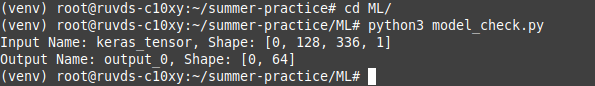
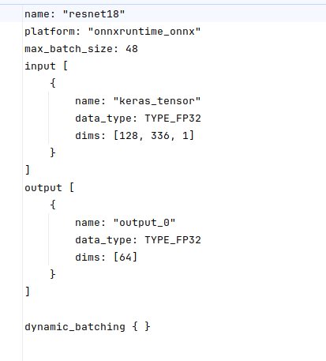

# summer-practice
___

## Начало работы
Создаем виртуальное окружение

```bash
python3 -m venv venv
```
активация 
```bash
source venv/bin/activate
```

Для того, чтобы скачать зависимости:
```bash
pip install -r requirements.txt
```

Также перед началом работы нужно установить:
```bash
pip install tritonclient[all]
```
```bash
pip install numpy
```

```bash
pip install torch
```
Для работы джанго приложения
```bash
pip install gunicorn
```

Для работы всей системы нужен докер 
    
    если его нет - установка любым способом https://docs.docker.com/engine/install/ubuntu/


### Настройка тритона

Запустил скрипт для получения данных о модели

Конфигурация соответственно с названиями из вывода программы


Для запуска Triton в папке ML/ нужно прописать, для настройки своего Triton, можно использовать те же Dockerfile и Docker compose с разницей только, что если есть Nvidia GPU, стоит раскомментировать строки 
```bash
sudo docker compose up -d
```
### WEB

#### Backend
В папке web/back выполнить, поднимаем Nginx и Postgres
```bash
sudo docker compose up -d
```

Для запуска Django
```bash
nohup gunicorn -b 0.0.0.0:8000 back.wsgi:application &

```

#### Frontend
В папке /web/front
Перед запуском, нужно установить NodeJS версии 16+

Выполнить:
Для установки зависимостей
```bash
npm install
```

```bash
npm run start &
``` 

 
